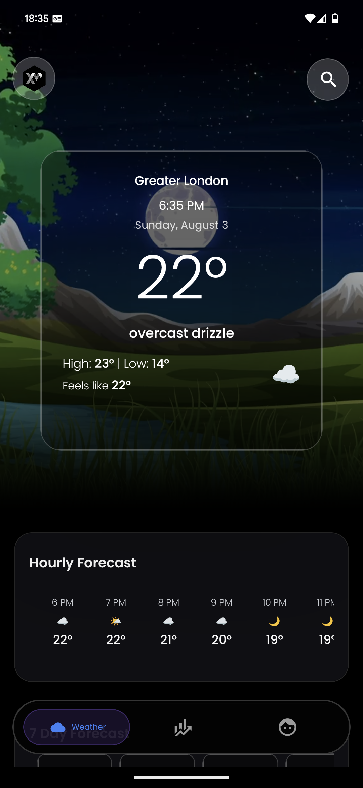
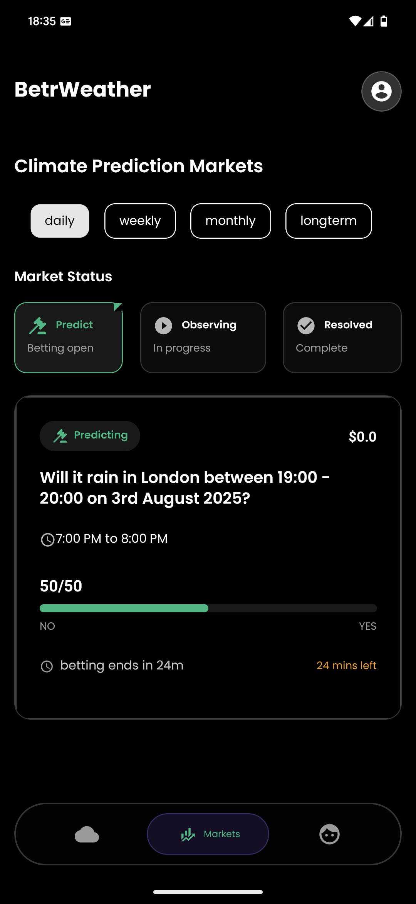
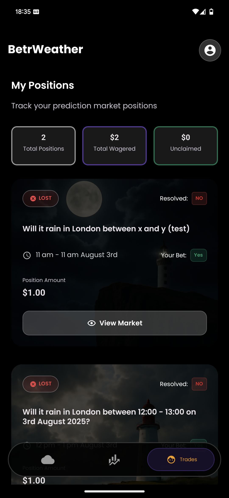

# Weather app with prediction markets on Solana Mobile

**BetrWeather is the default weather app for Solana Mobile.**
It's also a mobile-first weather prediction platform that lets users bet on weather outcomes using Solana. Get real-time weather data, place predictions, and earn rewards for accurate forecasts.

## 🏆 Solana Mobile Hackathon Entry

This project is submitted to the [Solana Mobile Hackathon](https://solanamobile.radiant.nexus/).

## 📱 Download & Setup

### APK Download
**[Download APK here]** *(Link to be added)*

### Installation Instructions
1. Download the APK file
2. Enable "Install from Unknown Sources" in your Android settings
3. Install the APK
4. Open the app and connect your Solana wallet
5. Get some devnet USDC/BONK: [Compatible USDC Faucet](https://faucet.circle.com/)

### Prerequisites
- Android device running Android 8.0+
- Solana wallet app (Phantom, Solflare, etc.)
- Internet connection for weather data and blockchain transactions

## 🚀 Features

- **Real-time Weather Data**: Live weather conditions and forecasts
- **Prediction Markets**: Bet on weather outcomes (temperature, precipitation, etc.)
- **Solana Integration**: Seamless wallet connection and transactions
- **Location-based**: Automatic location detection for local weather
- **Market Filters**: Browse by time period (daily, weekly, monthly)
- **Position Management**: Track your active bets and earnings

## 🛠 Tech Stack

- **Frontend**: React Native + Expo
- **Blockchain**: Solana (web3.js, Mobile Wallet Adapter)
- **Weather API**: Integration with weather data providers
- **Prediction Markets**: [DePredict protocol](https://github.com/endcorp-hq/depredict)
- **UI**: NativeWind (Tailwind CSS) + Custom components
- **State Management**: React Query + AsyncStorage
- **Native Development**: Kotlin for Android widgets and specialized features

## 📸 Screenshots

<table>
  <tr>
    <td align="center">
      
    </td>
    <td align="center">
      
    </td>
    <td align="center">
      
    </td>
  </tr>
</table>

## 🚀 Roadmap
- **Verified Weather Observations using TEE**: Use the Seeker's TEE to detect weather from photos and videos taken from the phone, for hyper local weather observation data. Users can be rewarded for providing this information.  
- **Add more data sources**: Ingest more data from decentralised climate and weather projects to improve weather prediction and forecasting. 
- **Rewards and gamification**: Implement rewards, streaks, achievements for people who predict the weather!

## 🔧 Development Setup

### Prerequisites
- Node.js 18+
- Yarn package manager
- Android Studio (for native development)
- Expo CLI
- Java 17+ (for Android builds)
- Android SDK 34+

### Quick Start
```bash
# Clone the repository
git clone <repository-url>
cd betrweather

# Install dependencies
yarn install

# Start development server
yarn start android 

# Build for Android (EAS Build - recommended)
yarn build

# Build for Android (local)
yarn build:local
```

### Environment Setup
1. **Install Expo CLI**: `npm install -g @expo/cli`
2. **Install Android Studio** and configure Android SDK
3. **Set up Android emulator** or connect physical device
4. **Install Solana wallet app** on device/emulator
5. **Configure environment variables** (see `.env.example`)

### Native Development (Kotlin)
This project includes native Kotlin development for:
- **Android Widgets**: Weather widgets for home screen
- **Background Services**: Location updates and notifications
- **Native Modules**: Performance-critical features
- **Custom Permissions**: Location and notification handling

#### Building Native Components
```bash
cd android
./gradlew assembleDebug
./gradlew assembleRelease
```

#### Native Development Workflow
1. **Modify Kotlin code** in `android/app/src/main/java/`
2. **Update AndroidManifest.xml** for new permissions
3. **Rebuild native modules**: `./gradlew clean && ./gradlew assembleDebug`
4. **Test changes** on device/emulator

## 🎯 Solana Mobile Features

- **Mobile Wallet Adapter**: Seamless wallet integration
- **Native Android**: Optimized for Android performance
- **Biometric Auth**: Secure wallet access
- **Background Location**: Widget updates and notifications

## 📊 Project Structure

```
src/
├── components/          # Reusable UI components
├── hooks/              # Custom React hooks
├── screens/            # Main app screens
├── solana/             # Solana integration
├── utils/              # Utility functions
└── types/              # TypeScript definitions
```

---

**Built for Solana Mobile Hackathon 2025** 🚀
